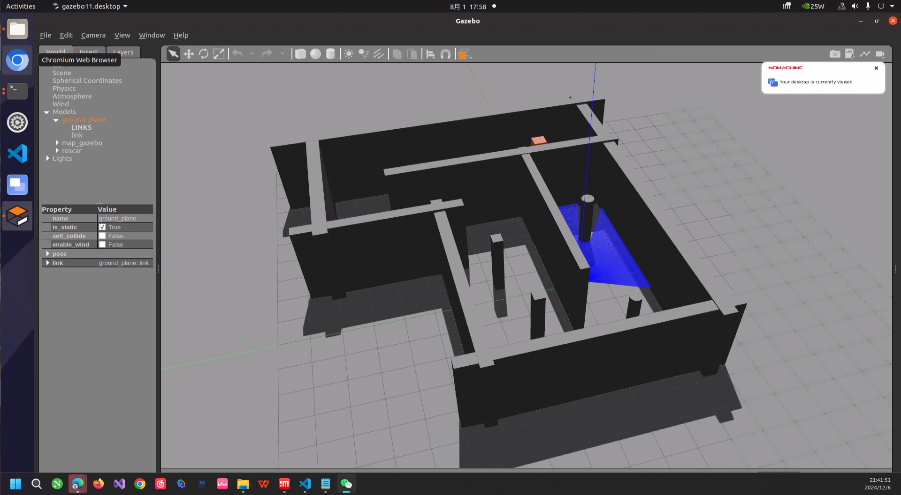
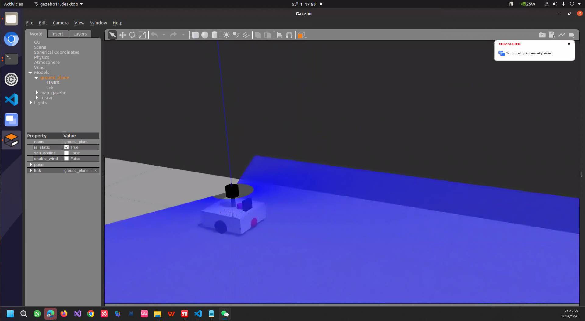
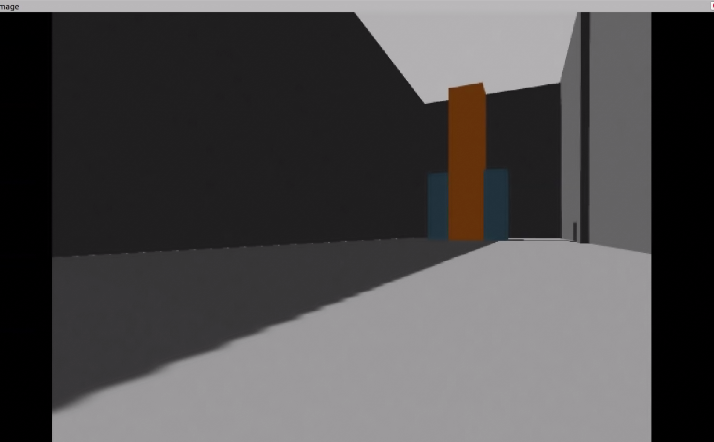

一、环境配置
Ubuntu20.04  ROS1-noetic

1.首先新建一个工作区
在该目录下新建src文件
进入src：
cd src
创建ROS包roscar：
catkin_create_pkg roscar cv_bridge gazebo_plugins gazebo_ros gazebo_ros_control image_transport roslib roscpp rospy sensor_msgs urdf xacro

2.修改CMakeLists.txt
添加其中C++代码必需的链接库等
catkin_package()

include_directories(
  ${catkin_INCLUDE_DIRS}
)

add_executable(camera_subscriber src/camera_subscriber.cpp)
add_executable(imu_subscriber src/imu_subscriber.cpp)

target_link_libraries(camera_subscriber 
                      ${catkin_LIBRARIES}
                      ${OpenCV_LIBRARIES}
)
target_link_libraries(imu_subscriber
                       ${catkin_LIBRARIES}
)

3.将提供的roscar中的所有文件夹（应该是7个）粘到你的roscar文件夹下，注意CMakeLists.txt和package.xml不要被替换，然后编译
catkin_make

4.运行launch
启动地图和机器人的gazebo
roslaunch roscar roscar_gazebo.launch
启动rviz和雷达点云图
roslaunch roscar roscar_move.launch
启动camera和imu的订阅节点
roslaunch roscar camera_imu.launch

完毕

注：
1.ros1大概的架构默认你一定了解的一些，所以这里并未细致地讲在哪个目录下
2.可能会安装 Arbotix，Arbotix 是一款控制电机、舵机的控制板，并提供相应的 ros 功能包
sudo apt-get install ros-noetic-arbotix
3.可能会安装键盘控制机器人的ROS包
sudo apt install ros-noetic-teleop-twist-keyboard

二、任务描述

该SDK耗时7天，从机器人xacro模型、世界gazebo模型到传感器的纯手搓ROS1小车仿真。由左右两个驱动轮、一个万向轮、一个2D激光雷达、一个普通单目摄像头、一个imu构成。

本次考核主要面对无人机的二维定点问题，随着光流技术日益成熟，电赛主办方更倾向于选择难以分辨的地面来干扰光流定点效果，雷达方案更加稳定。
在室内定位中，以imu为主，同时雷达点云数据辅助融合。

摄像头的camera_subscriber节点
imu的imu_subscriber节点
机器人接收/cmd_vel消息控制底盘的 线速度、角速度 来进行运动。
摄像头帧率30，像素640*480
雷达频率10，范围0.1m~10m，弧度-1~1
imu频率100

任务一：请用键盘发布/cmd_vel消息，控制机器人平移与旋转，并运动至能够看到橙蓝柱子的位置；  请简单录制并提交一个键盘控制视频
任务二：使用opencv，实时显示转化成HSV格式后的视频，保存任务一从原点移动至看到橙蓝柱子的HSV视频；要求在camera_subscriber.cpp编写代码；  请提交opencv保存的视频
任务三（难）：融合imu和雷达点云数据，并在终端发布自己位置，请在网上认真搜集资料并移植一个适合的算法；  请简单录制运行过程的视频

请提交视频与整个roscar包代码并发送给 yinzhe23@bupt.edu.cn

提示：
1.该SDK已配好rviz.config，map.world，xacro，model，主要在camera_subscriber.cpp、imu_subscriber.cpp编写，以及编写新的cpp与launch文件
2.由于gazebo问题，可能会出现障碍物悬浮在空中的情况，请在qq群中提问或私信解决
